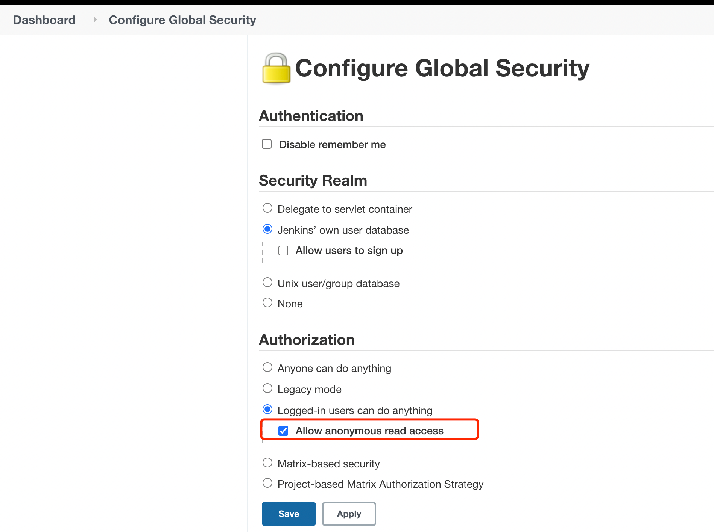
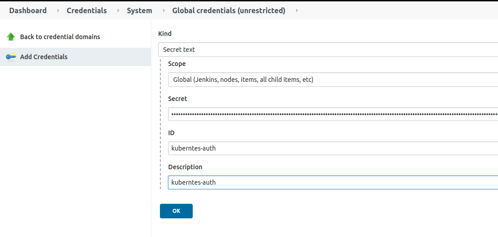
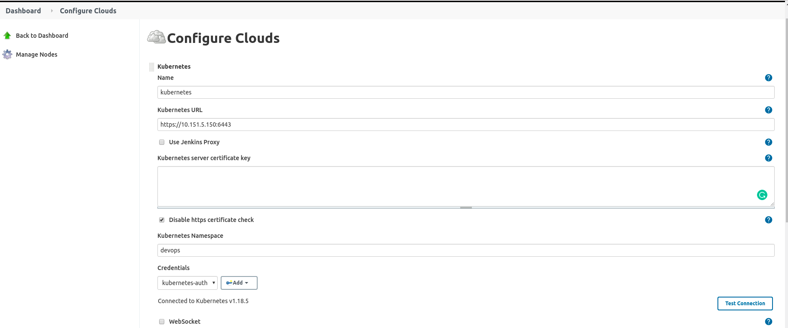

# Jenkins 流水线-依赖插件
* Kubernetes
* Pipeline
* Blue Ocean
* HTTP Request Plugin

# Jenkins for Docker 部署
```bash
$ docker run \
  --name jenkins-blueocean \
  -d \
  -p 8080:8080 \
  -p 50000:50000 \
  -v jenkins-data:/var/jenkins_home \
  jenkinsci/blueocean
  
$ docker exec -it jenkins-blueocean /bin/bash
jenkins@93f88d6ca212:/$ cat /var/jenkins_home/secrets/initialAdminPassword
a6f6d08fcc474178833001d1fc79be62
```

# Jenkins for Kubernetes 部署
# 镜像
* Jenkins Server:  jenkins/jenkins:2.328
* Jenkins Slave :  jenkins/inbound-agent:4.10-3

#2. 开启匿名用户的可读权限
``为了保证 流水线的 日志详情可以正常打开
``


#3. 配置Kubernetes cloud
* 创建RABC账号ServiceAccount
```bash
kubectl apply -f .\rabc.yml
```
* 注意默认授权的命名空间 **kube-lilin** .
## 获取ServiceAccount Auth
```bash
$ kubectl -n kube-lilin describe secret jekins-admin-token
```
## 创建 Secret text 类型的Credentials




## Jenkins URL
配置Jenkins url为对应 {ServiceName}.{Namespace}:{TargetPort}

例如:  http://jenkins.kube-lilin:8080/

注意: 这里使用的Kubernetes Namespace 注意要和创建的 ServiceAccount的 Namespace 保持一致。


## Jenkins内部构建镜像
### 使用kaniko镜像构建Docker Image
```json
{
  Name:       "docker",
  Image:      "yoyofx/kaniko-executor:debug",
  WorkingDir: "/home/jenkins/agent",
  CommandArr: []string{"cat"},
}
```
#### Docker Hub Auth信息
需要将Auth信息打包到/kaniko/.docker/config.json 文件中。
```bash
## 环境变量,这里以 hub.docker.com 为例:
{Key: "SGR_REGISTRY_ADDR", Value: "https://index.docker.io/v1/"},
{Key: "SGR_REGISTRY_AUTH", Value: "eWxxxxxxOnpsMTI1MzMwMw=="},
{Key: "SGR_REGISTRY_CONFIG", Value: "/kaniko/.docker"},

echo '{"auths": {"'$SGR_REGISTRY_ADDR'": {"auth": "'$SGR_REGISTRY_AUTH'"}}}' > $SGR_REGISTRY_CONFIG/config.json

```
Auth信息生成($SGR_REGISTRY_AUTH)：
```bash
echo -n 用户名:密码 | base64
```

# 目前支持的阶段
Checkout (串行) -> Compile (并行) -> Build (并行) -> Deploy (并行)