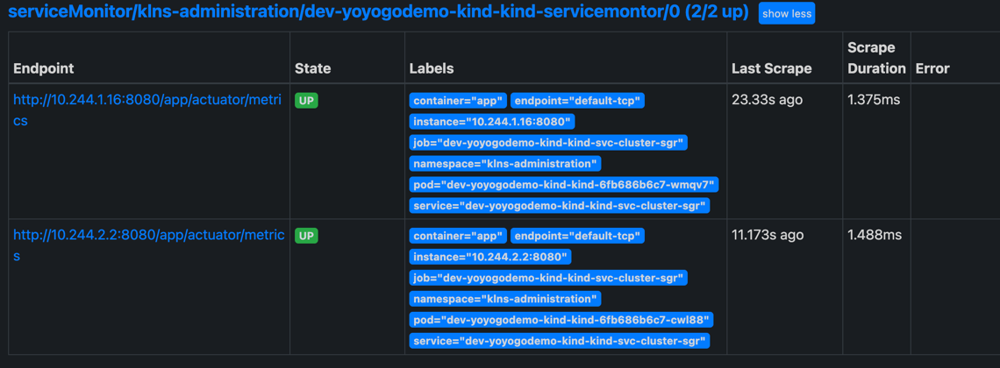
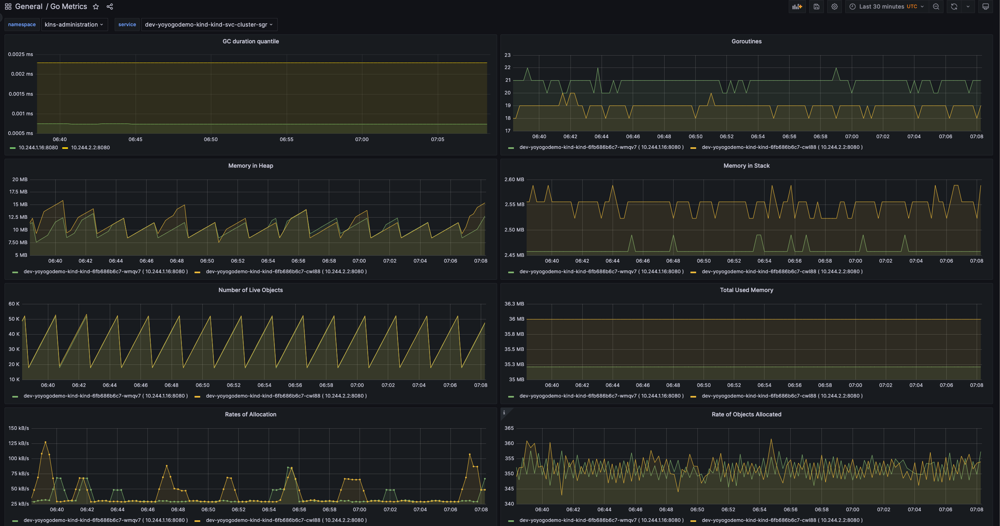

## 摘要
本文范围: Prometheus-Operator & kube-prometheus 安装；以及在解决使用ServiceMonitor时遇到的坑。

## Prometheus Operator 简介
随着云原生概念盛行，对于容器、服务、节点以及集群的监控变得越来越重要。Prometheus 作为 Kubernetes 监控的事实标准，有着强大的功能和良好的生态。但是它不支持分布式，不支持数据导入、导出，不支持通过 API 修改监控目标和报警规则，所以在使用它时，通常需要写脚本和代码来简化操作。Prometheus Operator 为监控 Kubernetes service、deployment 和 Prometheus 实例的管理提供了简单的定义，简化在 Kubernetes 上部署、管理和运行 Prometheus 和 Alertmanager 集群。

Prometheus Operator 功能如下：

* 创建/销毁：在 Kubernetes namespace 中更加容易地启动一个 Prometheues 实例，一个特定应用程序或者团队可以更容易使用 Operator。
* 便捷配置：通过 Kubernetes CRD资源配置 Prometheus 的基本信息，比如版本、(分布式)存储、副本集、高可用等。
* 通过标签标记目标服务： 基于常见的 Kubernetes label 查询自动生成监控目标配置；不需要学习 Prometheus 特定的配置语言。

它使用如下的 Kubernetes CRD 资源对 Prometheus进行配置:
* Prometheus
* Alertmanager
* ThanosRuler
* ServiceMonitor
* PodMonitor
* Probe
* PrometheusRule
* AlertmanagerConfig

### 参考文档:
* https://github.com/prometheus-operator/kube-prometheus
* https://prometheus-operator.dev/docs/operator/design/

### kube-prometheus 包含的软件包:
* The Prometheus Operator
* Highly available Prometheus
* Highly available Alertmanager
* Prometheus node-exporter
* Prometheus Adapter for Kubernetes Metrics APIs
* kube-state-metrics
* Grafana

### Prometheus Operator 兼容性
* Kubernetes 1.16+ ,如需更低版本的 Kubernetes 兼容性，请参考官方文档对应的版本分支。

以下代码分支对应的 Kubernetes 版本如下：
* release-0.9	1.21，1.22
* release-0.10  1.22，1.23
* release-0.11  1.23，1.24
* release-0.12  1.24，1.25

### 文章中已验证的版本(PaaS 安装版本)
* 本地集群(kind 1.25) release-0.12
* 腾讯云集群(TKE 1.20) release-0.9

### kube-prometheus 安装卸载
#### 安装
```sh
git clone https://github.com/prometheus-operator/kube-prometheus.git
git checkout release-0.12

cd kube-prometheus

kubectl apply --server-side -f manifests/setup

kubectl wait \
	--for condition=Established \
	--all CustomResourceDefinition \
	--namespace=monitoring
	
kubectl apply -f manifests/

```

#### 卸载
```sh
kubectl delete --ignore-not-found=true -f manifests/ -f manifests/setup
```

#### helm安装
```sh
helm repo add prometheus-community https://prometheus-community.github.io/helm-charts
helm repo update
helm install prometheus-community/kube-prometheus-stack --namespace monitoring --generate-name
```
无论哪种安装方式，遇到镜像拉取失败的情况，可以使用如下命令手动拉取镜像并推送到自己的仓库，本文中推送到自己的docker hub仓库中，替换yaml中的image地址，然后再次执行安装命令。

## ServiceMonitor
ServiceMonitor 自定义资源(CRD)能够声明如何监控一组动态服务的定义。它使用标签选择定义一组需要被监控的服务。这样就允许组织引入如何暴露 metrics 的规定，只要符合这些规定新服务就会被发现列入监控，而不需要重新配置系统。
一个 Service 可以公开一个或多个服务端口，通常情况下，这些端口由指向一个 Pod 的多个 Endpoints 支持。这也反映在各自的 Endpoints 对象中。
ServiceMonitorSpec 的 endpoints 部分用于配置需要收集 metrics 的 Endpoints 的端口和其他参数。在一些用例中会直接监控不在服务 endpoints 中的 pods 的端口。

### 例子
有如下 Service 指向 labels: k8s-app=dev-yoyogodemo-kind-kind 的 部署(Deployment)：
```yaml
apiVersion: v1
kind: Service
metadata:
  name: dev-yoyogodemo-kind-kind-svc-cluster-sgr
  namespace: klns-administration
  labels:
    k8s-app: dev-yoyogodemo-kind-kind
spec:
  ports:
    - name: default-tcp
      protocol: TCP
      port: 8080
      targetPort: 8080
  selector:
    k8s-app: dev-yoyogodemo-kind-kind

  type: ClusterIP
  sessionAffinity: None
```
为其创建 ServiceMonitor 资源定义如下：
```yaml
apiVersion: monitoring.coreos.com/v1
kind: ServiceMonitor
metadata:
  name: dev-yoyogodemo-kind-kind-servicemontor
  namespace: klns-administration
  labels:
    k8s-app: dev-yoyogodemo-kind-kind
spec:
  endpoints:
    - interval: 15s
      path: /app/actuator/metrics
      port: default-tcp
  namespaceSelector:
    matchNames:
    - klns-administration
  selector:
    matchLabels:
      k8s-app: dev-yoyogodemo-kind-kind
```
### 采坑
在默认配置中，此 ServiceMonitor 会因为 Kubenertes RBAC 集群权限问题，导致 ServiceMonitor不生效，表现为在Prometheus 的 targets 中看不到该 ServiceMonitor 的 targets。
查看StatefulSet工作负载 prometheus-k8s 的状态，查看日志，看到如下报错:
```bash
services is forbidden: User "system:serviceaccount:monitoring:prometheus-k8s" cannot list services in the namespace monitoring
```
这是因为默认只配置了get权限 。解决办法是为 ServiceMonitor 添加如下的 ClusterRoleBinding,编辑 **prometheus-k8s** 角色绑定，添加如下内容:
```yaml
...
- apiGroups:
    - ""
  resources:
    - services
    - endpoints
    - pods
  verbs:
    - get
    - list
    - watch
```
修改后重启 StatefulSet: **prometheus-k8s**; ServiceMonitor就会找到对应 Service 资源的 labels 选择器的Endpoint资源, 并且会被 Prometheus Operator 自动配置为 Prometheus 的 targets。


当然ServiceMonitor不生效的原因还有很多，比如ServiceMonitor的namespaceSelector和selector不匹配，或者ServiceMonitor的namespaceSelector和Service的namespace不匹配等等。
### 为什么配置的ServiceMonitor或PodMonitor未生效？
#### 排查步骤:
* 确认Target是否已经被发现,找到目标Prometheus实例，然后在左侧导航栏单击服务发现，然后单击Targets页签，检查相应的Target是否已经被发现。
* 查看集群CRD中是否存在相应的ServiceMonitor资源。
* 确认Label Selector是否能选择到期望的Pod或者Service
    ```bash
    # 以上面那个例子为例。执行以下命令，观察返回结果，若无返回结果，则需要调整Label Selector或Namespace Selector，即可筛选出期望的Pod或者Service。
    
    kubectl get service -l k8s-app=dev-yoyogodemo-kind-kind -n klns-administration
    ```
* 检查端口设置,端口port字段，需要指定为pod定义中spec.containers[i].ports[i].name，或services定义中spec.ports[i].name字段的值。

## 配置Grafana
导入grafana_go_metrics.json 到Grafana面板。 修改数据源为Prometheus，修改Prometheus数据源地址为：prometheus-k8s.monitoring.svc:9090 或映射出的地址。


## 二次开发
如上图，第一个GC图表，可以通过如下 PromQL 查询语句获取数据：
```sql
sum(go_gc_duration_seconds{namespace="klns-administration", service="dev-yoyogodemo-kind-kind-svc-cluster-sgr"}) by (instance)
```
实际应用中将namespace和service替换为变量，即可实现多个服务的GC图表。